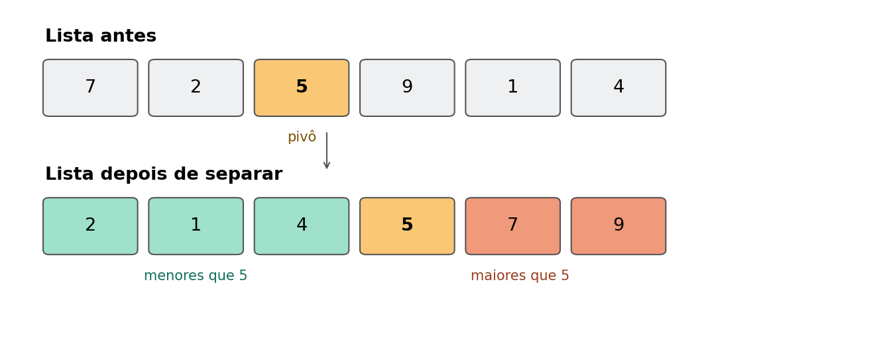
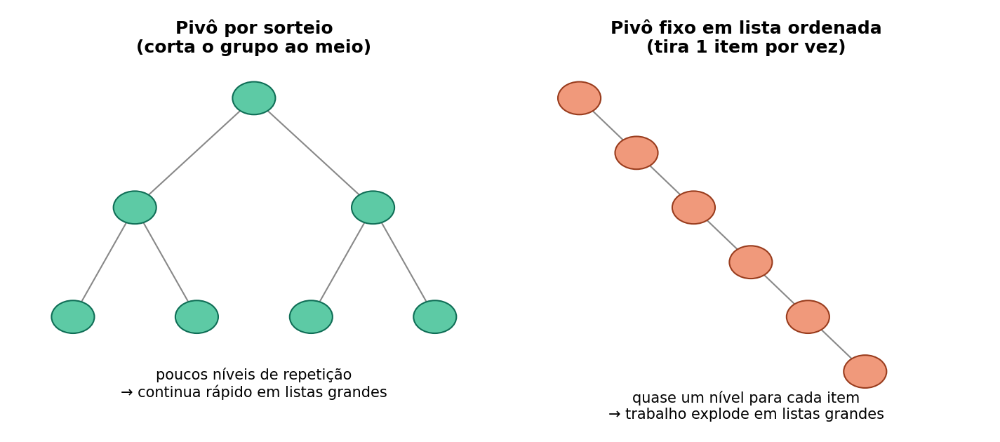
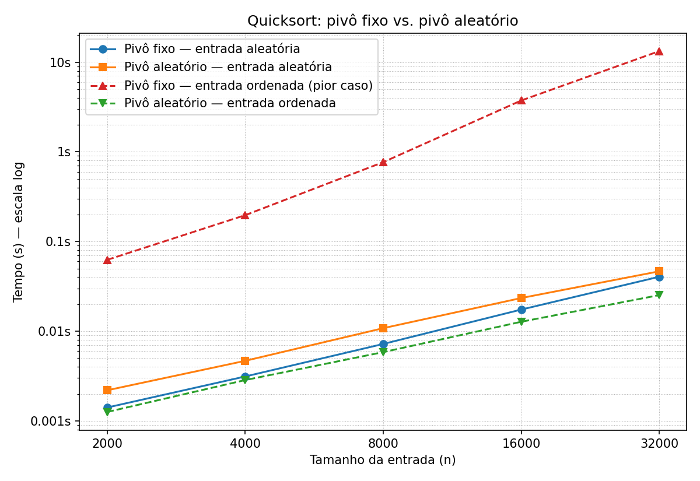

# Quicksort: escolhendo o pivô sempre no mesmo lugar vs. escolhendo por sorteio

## 1. O que é o Quicksort

Quicksort é um jeito de colocar uma lista de números em ordem. A ideia
central, em três passos:

1. Escolhe um número da lista pra ser o **pivô**.
2. Separa todo mundo em dois grupos: quem é **menor** que o pivô e quem
   é **maior**.
3. Repete esse processo dentro de cada grupo, até sobrar grupos de 1
   número só (que já estão "ordenados" por definição).

Veja como fica uma rodada desse processo:



Isso se repete em cascata dentro de cada grupo menor, até tudo estar
ordenado.

## 2. A única coisa que muda entre as duas versões: como o pivô é escolhido

- **Pivô fixo**: sempre pega o primeiro número da lista (ou do pedaço da
  lista que está sendo processado naquele momento).
- **Pivô por sorteio**: sorteia um número qualquer daquele pedaço.

E testamos isso em dois tipos de entrada:

- **Lista embaralhada** (números em ordem qualquer).
- **Lista já ordenada** (números do menor para o maior).

Parece um detalhe pequeno, mas muda tudo dependendo de como os dados
chegam. Pensa no Quicksort como organizar uma fila de pessoas por
altura: você escolhe uma pessoa (o pivô) e manda todo mundo mais baixo
pra um lado e mais alto pro outro.

- Se você sempre escolhe **a primeira pessoa da fila**, e essa fila **já
  está em ordem crescente**, você sempre vai escolher a pessoa mais
  baixa do grupo. Resultado: um lado fica vazio e o outro lado fica com
  todo mundo, menos uma pessoa. Você mal "cortou" o problema — só tirou
  uma pessoa de cada vez.
- Se você **sorteia** quem vai ser o pivô, não importa se a fila já
  estava ordenada ou não — as chances de cair sempre na pessoa mais
  baixa (ou mais alta), repetidas vezes, são baixíssimas. Na prática o
  grupo sempre acaba sendo dividido de forma mais ou menos equilibrada.

Essa diferença se acumula a cada repetição, e o resultado é uma "altura"
bem diferente de quantas vezes o processo precisa se repetir:



Do lado esquerdo (sorteio), o grupo é cortado ao meio a cada passo, então
bastam poucas repetições mesmo com uma lista grande. Do lado direito
(pivô fixo em lista já ordenada), cada repetição só consegue tirar uma
pessoa do jogo — então o número de repetições cresce quase junto com o
tamanho da lista inteira.

Ou seja: o pivô fixo não é "ruim" no geral — ele só tem um ponto fraco
bem específico (listas já ordenadas, ou quase ordenadas), e quando bate
nesse ponto fraco, o desempenho desmorona. O sorteio existe justamente
para não deixar o algoritmo ter esse ponto fraco previsível — o que
importa inclusive em sistemas reais, porque alguém poderia "provocar" o
pior caso de propósito enviando dados já ordenados.

### Bônus: isso é a mesma coisa que uma árvore binária de busca

A árvore de repetições da imagem acima não é só uma analogia — ela é,
literalmente, uma **árvore binária de busca (BST)**. Cada pivô escolhido
vira a raiz de uma sub-árvore; tudo que é menor que ele forma a
subárvore da esquerda, tudo que é maior forma a subárvore da direita.
Se você pegar a sequência de pivôs escolhidos pelo Quicksort, na ordem
em que foram escolhidos, e inserir esses números um por um numa BST
comum (sem nenhum balanceamento), a árvore que se forma é exatamente a
mesma que o Quicksort "desenhou" durante a recursão.

Isso dá pra ler nas duas pontas:

- **Pivô por sorteio ≈ BST construída com inserções em ordem
  aleatória.** É um resultado conhecido que uma BST assim tem altura
  esperada O(log n) — a mesma classe que medimos no experimento.
- **Pivô fixo em lista já ordenada ≈ BST construída inserindo os
  números em ordem crescente.** Inserir 1, depois 2, depois 3... numa
  BST sem balancear faz cada número novo virar sempre filho direito do
  anterior — a árvore não abre pros dois lados, ela vira uma corrente
  reta, que na prática é uma **lista ligada**. Altura O(n). É
  exatamente a "escada" do diagrama, e é o mesmo motivo pelo qual uma
  lista ordenada é o pior caso tanto pra uma BST simples quanto pra um
  Quicksort com pivô fixo.

É a mesma raiz do problema por trás do outro par de opções do
enunciado, "BST simples vs. AVL": uma árvore AVL existe justamente pra
impedir que uma sequência de inserções ordenada degenere a árvore numa
lista ligada, rebalanceando pra manter altura O(log n) sempre — o
equivalente, no mundo das árvores, do que o pivô aleatório faz pro
Quicksort. A diferença é que o Quicksort resolve o problema de um jeito
mais simples: em vez de rebalancear depois que o desequilíbrio já
aconteceu, ele evita o desequilíbrio de cara, embaralhando a ordem de
entrada via sorteio do pivô.

## 3. O que isso significa em "quantidade de trabalho"

Quando alguém fala em O(n log n) ou O(n²), é só um jeito de resumir
**quanto o trabalho cresce conforme a lista cresce**:

- **O(n log n)** (pivô por sorteio nos dois cenários, e pivô fixo em
  lista embaralhada): o trabalho cresce quase na mesma proporção do
  tamanho da lista. Na prática, dobrar o tamanho da lista faz o tempo
  praticamente **dobrar** também.
- **O(n²)** (pivô fixo em lista ordenada): o trabalho cresce muito mais
  rápido que o tamanho da lista. Dobrar o tamanho da lista faz o tempo
  **quadruplicar**.

Não precisa decorar a fórmula — o que importa é a conclusão prática: um
algoritmo O(n²) fica inviável muito mais depressa conforme os dados
crescem, enquanto um O(n log n) continua tranquilo.

## 4. O que descobrimos, direto ao ponto

O jeito mais confiável de comparar os quatro casos não é olhar quanto
tempo cada um "levou" (0,06s? 13 segundos? isso depende da máquina, do
que mais está rodando nela, etc.) — é olhar **quantas vezes o tempo
aumenta toda vez que a lista dobra de tamanho**. Essa razão é o que
realmente revela como cada algoritmo se comporta, e é ela que usamos
como evidência principal (mais detalhes na seção 6).

- Quando a lista já vem **embaralhada**, não importa muito como você
  escolhe o pivô: toda vez que a lista dobra de tamanho, o tempo também
  praticamente **dobra** (um pouco mais), nos dois algoritmos.
- Quando a lista já vem **ordenada**, o pivô por sorteio continua se
  comportando do mesmo jeito — dobrar o tamanho dobra o tempo. Mas o
  **pivô fixo muda de comportamento**: toda vez que a lista dobra de
  tamanho, o tempo **quadruplica**. Esse é o sinal de que ele entrou no
  pior caso descrito na seção 2.

O gráfico abaixo deixa isso bem visível: três linhas praticamente
coladas lá embaixo, subindo devagar, e uma linha vermelha disparando lá
em cima, com uma inclinação nitidamente mais acentuada. (O eixo vertical
está em "escala log" — cada linha da grade é 10x maior que a de baixo —
porque, numa escala normal, a linha vermelha dispararia tanto que as
outras três ficariam grudadas e ilegíveis lá embaixo.)



## 5. Os números por trás do gráfico

Usamos listas a partir de 2.000 itens (em vez de começar em 1.000) de
propósito: em listas muito pequenas, o tempo medido fica tão baixo (menos
de 1 milissegundo) que pequenas interferências do computador — outros
programas rodando, o sistema operacional trocando de tarefa por um
instante — podem distorcer a medida mais do que o próprio algoritmo. Com
listas maiores, o tempo medido fica bem acima desse "ruído de fundo", e
a comparação fica mais confiável.

Tempo que cada versão levou para ordenar listas de tamanhos diferentes
(quanto menor, melhor — mas lembre-se, o que importa é a razão entre as
colunas, não o valor absoluto, veja a seção 6):

| Tamanho da lista | Fixo, embaralhada | Sorteio, embaralhada | Fixo, ordenada | Sorteio, ordenada |
|---:|---:|---:|---:|---:|
| 2.000 | 0,0014s | 0,0022s | 0,062s | 0,0013s |
| 4.000 | 0,0031s | 0,0047s | 0,197s | 0,0028s |
| 8.000 | 0,0072s | 0,0108s | 0,767s | 0,0058s |
| 16.000 | 0,0174s | 0,0234s | 3,736s | 0,0127s |
| 32.000 | 0,0404s | 0,0465s | 13,277s | 0,0252s |

## 6. Por que olhamos a razão entre tempos, e não o tempo em segundos

Dizer "levou 13 segundos" não conta muita coisa sozinho — depende do
computador, do que mais está rodando nele, etc. O que realmente
identifica o comportamento do algoritmo é: **toda vez que eu dobro o
tamanho da lista, quantas vezes o tempo aumenta?**

- Se o tempo só dobra → o algoritmo é "bem comportado" (O(n log n),
  seção 3).
- Se o tempo quadruplica → o algoritmo está no seu ponto fraco (O(n²)).

**Razão entre o tempo em cada tamanho e o tempo no tamanho anterior**
(essa é a tabela que realmente conta a história):

| Dobrou de → para | Fixo, embaralhada | Sorteio, embaralhada | Fixo, ordenada | Sorteio, ordenada |
|---|---:|---:|---:|---:|
| 2.000 → 4.000 | 2,22x | 2,13x | **3,15x** | 2,27x |
| 4.000 → 8.000 | 2,31x | 2,31x | **3,90x** | 2,05x |
| 8.000 → 16.000 | 2,42x | 2,17x | **4,87x** | 2,18x |
| 16.000 → 32.000 | 2,32x | 1,99x | **3,55x** | 1,98x |

Três colunas ficam sempre perto de "dobrar" (2,0x a 2,4x) não importa o
tamanho. A coluna do meio (pivô fixo em lista ordenada) fica sempre bem
mais alta que isso — na média, perto de "quadruplicar" (3,15x a 4,87x) —
e essa diferença de padrão se mantém em todos os tamanhos testados, não
é coisa de um ponto isolado.

<details>
<summary>Para quem quiser a versão com a notação formal (O(n log n) / O(n²))</summary>

- Pivô fixo/embaralhada, sorteio/embaralhada e sorteio/ordenada crescem
  como **O(n log n)**: dobrar o tamanho da entrada multiplica o tempo por
  um fator que se aproxima de 2 (confirmado pelas razões medidas, todas
  entre 1,98x e 2,42x).
- Pivô fixo/ordenada cresce como **O(n²)**: dobrar o tamanho da entrada
  multiplica o tempo por um fator que se aproxima de 4 (confirmado pelas
  razões medidas, entre 3,15x e 4,87x, com média ~3,9x — bem mais perto de
  4 do que de 2). De n=2.000 para n=32.000 (16x o tamanho) o tempo cresceu
  ~213x — muito mais próximo do 16² = 256 esperado para O(n²) do que do
  ~16x esperado para O(n log n).

</details>

## 7. Como medimos (pra ninguém desconfiar do resultado)

- Testamos com listas de 2.000, 4.000, 8.000, 16.000 e 32.000 números
  (cada tamanho é o dobro do anterior). Começamos em 2.000 em vez de
  1.000 de propósito, pra que até o ponto mais rápido do experimento já
  ficasse claramente acima do ruído de medição (seção 5).
- Para cada tamanho, rodamos 4 vezes: a primeira rodada é só "aquecimento"
  e é descartada; das outras 3, guardamos o valor do meio (a mediana),
  pra um resultado fora da curva não distorcer a conta.
- A lista embaralhada usa sempre a mesma "semente" de aleatoriedade
  (número 42), então o experimento pode ser repetido e dá exatamente o
  mesmo resultado.
- Comparamos os algoritmos pela **razão entre tempos consecutivos**
  (tempo em 2n dividido pelo tempo em n), não pelo tempo absoluto (seção
  6) — é essa razão que mostra se o algoritmo está "dobrando junto" com o
  tamanho da entrada ou crescendo mais rápido que isso.

## 8. Como rodar você mesmo

Precisa de Python 3 e da biblioteca `matplotlib`:
```bash
pip install matplotlib --break-system-packages
```

Depois, dentro da pasta `src/`:
```bash
python3 bench.py            # roda o teste e salva os tempos em ../dados/resultados.csv
python3 analise_razoes.py   # mostra no terminal quanto o tempo cresceu a cada duplicação
python3 gerar_grafico.py    # gera o gráfico em ../graficos/comparacao.png
```

## 9. O que tem em cada pasta

```
README.md      este arquivo
src/           o código (os dois algoritmos + o script que mede + o script que faz o gráfico)
dados/         os tempos medidos, em uma planilha simples (CSV)
graficos/      o gráfico comparativo + os dois diagramas explicativos
```
